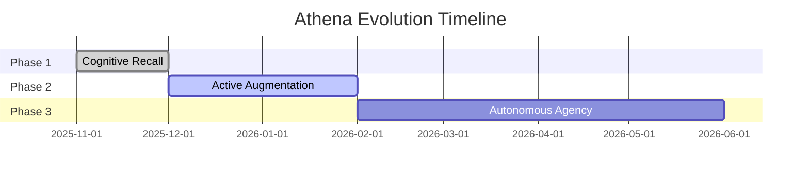

# 🗺️ Living Roadmap

> **Vision**: Athena is not a static script. It is an evolving cognitive organism.

This roadmap outlines the strategic trajectory for the system, moving from **Recall** (Current) to **Autonomy** (Future).

---

## 🏗️ Phase 1: Cognitive Recall (Completed) ✅

*Focus: Memory, Context, and Retrieval*

- [x] **VectorRAG Memory**: Supabase + pgvector for semantic search across 800+ documents.
- [x] **Adaptive Latency Architecture**: "Bleach" Scaling Law (Shikai/Bankai/Shukai) for token efficiency.
- [x] **Anti-Hallucination Layer**: Claim atomization and strict citation protocols.
- [x] **Supabase Memory**: Implementing `pgvector` for semantic search.
- [x] **Protocol Library**: Codifying 241 decision frameworks (Finance, Architecture, Strategy).
- [x] **Temporal Continuity**: Linking sessions via `/start` and `/end` workflows.
- [x] **Anti-Entropy Engine**: The `/refactor` daily cleaning protocol.
- [x] **Public Documentation**: Problem-Solution-Outcome framing for recruiter visibility.

---

## 🚀 Phase 2: Active Augmentation (In Progress) 🚧

*Focus: Real-time assistance and friction reduction*

- [x] **Multimodal Analysis Engine**
  - **Goal**: Analyze video pacing, audio scripts, and visual dynamics.
  - **Tech**: `ffmpeg` + `openai-whisper` + `cv2` forensics.
  - **Status**: Visual/Audio scripts deployed.

- [x] **Voice Interface Integration**
  - **Goal**: Talk to Athena while walking/driving.
  - **Tech**: Gemini multimodal audio transcription.
  - **Status**: Implemented via Telegram Bot voice notes.

- [x] **Mobile Sync Strategy (Telegram Bot)**
  - **Goal**: Access knowledge base on mobile.
  - **Tech**: Telegram Bot + Gemini 3 Flash + Git sync.
  - **Status**: Athena-Lite deployed. `/start` → Chat → `/end` → Cloud sync.

- [ ] **"Shower Thought" Capture Pipeline**
  - **Goal**: Reduce friction from Insight → Protocol.
  - **Tech**: Global hotkey overlay for instant dump + auto-tagging.

---

## 🔮 Phase 3: Autonomous Agency (Planned)

*Focus: Systems that run without me*

- [ ] **Daily Briefing Agent**
  - **Goal**: Athena wakes up at 6 AM, reads news/market data, and prepares a "Morning Brief" based on my portfolio.
  - **Tech**: Scheduled cron jobs + Search Tool + Synthesis.

- [ ] **Recursive Self-Optimization**
  - **Goal**: System analyzes its own logs to suggest new protocols.
  - **Tech**: Weekly "Meta-Analysis" batch job.

---

## 💡 Request a Feature

Have an idea for Athena? [Clone the repo](https://github.com/winstonkoh87/Athena-Public) and build it yourself. That's the point.
