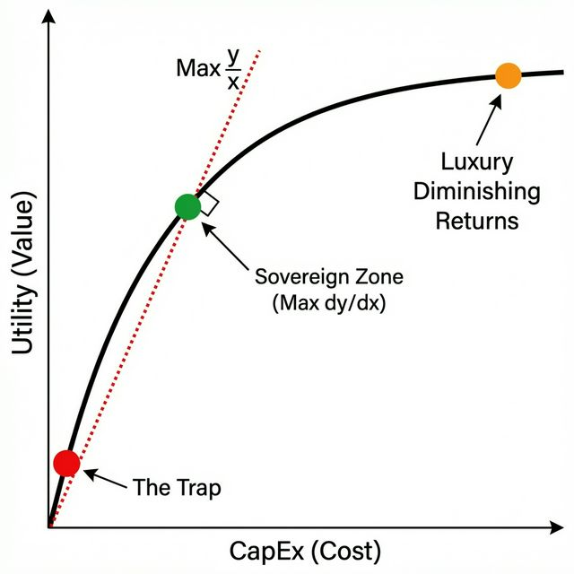

# Protocol 106: Min-Max Optimization

> **Core Theorem**: "Maximize the Utility Function (Indifference Curve) while Minimizing CapEx."
> **Metric**: Return on Effort (RoE).

## The Philosophy

In a Sovereign System, **Energy** and **Time** are the only finite resources. Money is renewable; Time is not.
Therefore, every action must pass the **Min-Max Test**:

* *Is the effort verification (Min) proportional to the value generated (Max)?*

## The Three Pillars

### 1. Procurement (The U/P Ratio)

* **Goal**: Maximize Utility per Dollar.
* **Mechanism**: [Purchase Heuristic](file:///Users/winstonkoh/Desktop/Project Athena/.context/references/PURCHASE_HEURISTIC_UP_RATIO.md)
* **Application**: Buying the $39 Mistral fan (Top Utility, Low Cost) vs the $600 Dyson (High Cost, Same Utility).

### 2. Operations (The Lazy Commander)

* **Goal**: Maximize Output per Keystroke.
* **Mechanism**: [Protocol 10](.agent/skills/protocols/workflow/010-agentic-success-trinity.md) (Automate -> Delegate -> Delete).
* **Application**: Using `Ag` (Athena) to draft emails instead of writing them manually. "Never do with hands what can be done with a script."

### 3. Energy (The 80/20 Law)

* **Goal**: Maximize Impact per Calorie.
* **Mechanism**: [Protocol 311](.agent/skills/protocols/strategy/311-priority-management.md) (Eisenhower Matrix).
* **Application**: Skipping the "Perfect" solution (100% effort) for the "Good Enough" solution (20% effort, 80% outcome) when stakes are low.

## The Sovereign Standard

* **Amateur**: Maximizes Output at *any* cost (Burnout).
* **Sovereign**: Maximizes Output at *minimum* cost (Sustainability).

> "The ultimate sophistication is getting the result without doing the work."
